 
  

 <h1>⚔ RAID Core: Fighting, RAIDing, Tasking.</h1>
 

## What's this?

A plugin API for making RAID/MMORPG plugin.

Note: Only support Kotlin.

## What's provided?

- [x] Party
- [x] Enemy
- [ ] Task
- [ ] RAID